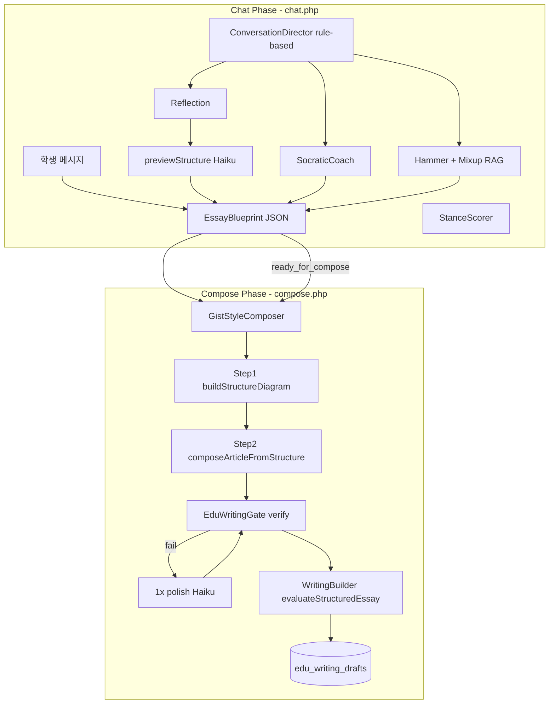
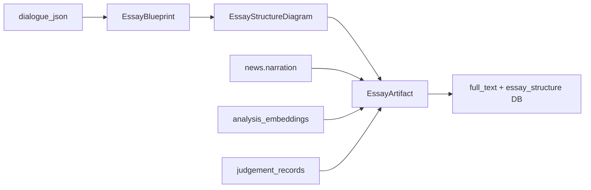

# GIST EDU: 구조도 · 스키마 · 파이프라인 · LLM 현황 보고

## 1. 한눈에 보기

| 축 | 현재 상태 |
|----|-----------|
| LLM 제공자 | **Anthropic 단독** ([`public/api/edu/lib/_llm.php`](public/api/edu/lib/_llm.php)) |
| 기본 모델 | `claude-sonnet-4-20250514` |
| 경량 모델 | `claude-haiku-4-20250514` (`haiku()` 호출 시) |
| structured output | **네이티브 json_mode 없음** — 프롬프트 JSON 예시 + [`EduLlmJson::parse`](src/backend/Services/edu/EduLlmJson.php) |
| 대화 엔진 | [`POST /api/edu/session/chat.php`](public/api/edu/session/chat.php) |
| 글 생성 | [`POST /api/edu/session/compose.php`](public/api/edu/session/compose.php) |
| 하네스 상태 | `EssayBlueprint` → Supabase `blueprint_json` |

---

## 2. 전체 파이프라인



**대화 단계 (가변, 스텝 수 고정 없음)**

| Phase | 에이전트 | LLM | 트리거 |
|-------|----------|-----|--------|
| stance | SocraticCoach `askWhy` | Sonnet | 찬반 선택 |
| reasoning | SocraticCoach + `evaluateResponse` | Sonnet + Haiku | 이유 입력 |
| evidence | (안내) + depth eval | Haiku | 근거 입력 |
| hammer | StanceScorer + Hammer + Mixup RAG | Haiku + Sonnet | 근거 후 자동 |
| reflection | Reflection `summarize` | Sonnet | 반론 재답변 후 |
| compose | reflection 확인 → `previewStructure` + `compose.php` | Haiku + Sonnet | reflection 확인 |

**라우팅:** [`ConversationDirector`](src/backend/Services/edu/Agents/ConversationDirector.php) — **규칙 기반 FSM** (LLM은 `refinePrompt` 톤 다듬기에만 선택적 Haiku). phase budget: reasoning followup 2회, evidence nudge 1회, 전체 12 exchange cap.

---

## 3. 스키마 3계층

### 3-A. EssayBlueprint (대화 하네스)

**파일:** [`public/api/edu/lib/eduBlueprint.php`](public/api/edu/lib/eduBlueprint.php)  
**저장:** `edu_quest_sessions.blueprint_json` (fallback: `hammer_payload.blueprint`)

```json
{
  "stance": "pro|con",
  "reason": "...",
  "reason_depth": 1-5,
  "reason_followup_count": 0,
  "evidence": "...",
  "counter_argument": "...",
  "rebuttal": "...",
  "counter_handled": true,
  "stance_changed": false,
  "final_stance": "pro|con",
  "reflection_lines": ["...", "...", "..."],
  "reflection_confirmed": true,
  "phase": "stance|reasoning|evidence|hammer|reflection|compose|completed",
  "exchange_count": 0,
  "ready_for_compose": true,
  "essay_structure": {},
  "essay_artifact": {}
}
```

역할: 대화 진행 상태·학생 발화 축적. **reflection 확인 시 `essay_structure`(불릿 구조도)가 채워지고**, compose 시 Step2에서 장문으로 확장된다.

---

### 3-B. Essay Structure Diagram (글 구조도 — Step 1)

**파일:** [`GistStyleComposer::buildStructureDiagram`](src/backend/Services/edu/Agents/GistStyleComposer.php)  
**LLM:** Haiku, max_tokens 700, temperature 0.3  
**입력:** blueprint + dialogue 전체 + quest 메타  
**출력 스키마 (프롬프트 정의):**

```json
{
  "title": "학생 시각 헤드라인",
  "subtitle": "한 줄 요약",
  "sections": [
    {
      "heading": "소제목",
      "role": "background|tension|stance|counter",
      "bullets": ["학생 발화 기반 핵심 1", "핵심 2"]
    }
  ],
  "conclusion_heading": "결론",
  "conclusion_bullets": ["...", "..."],
  "student_stance": "찬성|반대"
}
```

특징: **본문 없음, 불릿만.** 대화에서 추출한 생각의 뼈대. 실패 시 `fallbackStructure()` 규칙 생성.  
**미리보기:** reflection 확인 시 `chat.php`가 `previewStructure()` 호출 → `structure_preview` API 응답 + [`StructurePreviewCard`](src/frontend/src/components/edu/StructurePreviewCard.tsx) UI.

---

### 3-C. Essay Artifact (완성 글 — Step 2)

**파일:** [`GistStyleComposer::composeArticleFromStructure`](src/backend/Services/edu/Agents/GistStyleComposer.php)  
**LLM:** Sonnet, max_tokens 2200, temperature 0.55  
**입력:** 구조도 JSON + narration few-shot + arc RAG + judgement patterns  
**출력 스키마 (프롬프트 정의):**

```json
{
  "title": "...",
  "subtitle": "...",
  "sections": [
    {"heading": "소제목", "paragraphs": ["문단1", "문단2"]}
  ],
  "conclusion_heading": "결론",
  "conclusion_paragraphs": ["문단1", "문단2"],
  "full_text": "제목~결론 전체 plain text",
  "hero_sentence": "공유카드용 1문장"
}
```

**저장:** [`compose.php`](public/api/edu/session/compose.php)
- `edu_writing_drafts.full_text`
- `edu_writing_drafts.essay_structure` (구조도+섹션 JSON)
- `blueprint_json.essay_artifact` (fallback)
- `edu_writing_versions` — SCQA 5슬롯 (하위 호환, structure→scqa 변환)

**hero 우선순위:** `draft.hero_sentence`(composer) → evaluation fallback → `eduExtractHeroSentence`

---

## 4. LLM 호출 맵 (세션 1회 기준 추정)

| 호출 위치 | 모델 | max_tokens | 빈도(대화당) | 용도 |
|-----------|------|------------|--------------|------|
| SocraticCoach `askWhy` | Sonnet | 256 | 1~3 | 질문 생성 |
| SocraticCoach `evaluateResponse` | Haiku | 200 | 3~5 | depth gate |
| ConversationDirector `refinePrompt` | Haiku | 150 | 0~N | 질문 톤 다듬기 |
| StanceScorer `scoreStance` | Haiku | — | 1 | 반론 강도 |
| Hammer `strike` | Sonnet | 400 | 1 | 반론 생성 |
| Reflection `summarize` | Sonnet | 300 | 1 | 3줄 정리 |
| **GistStyleComposer `previewStructure`** | **Haiku** | **700** | **1** | **구조도 미리보기 (reflection)** |
| **GistStyleComposer Step2** | **Sonnet** | **2200** | **1** | **장문 작성** |
| EduWritingGate `polish` | Haiku | 1200 | 0~1 | verify 실패 시 |
| WritingBuilder `evaluateStructuredEssay` | Haiku | 350 | 1~2 | 구조화 글 품질 |

**대화 1회 + 글 완성 합계:** Sonnet 약 5~7회, Haiku 약 7~11회

**설정**
- API 키: `EDU_ANTHROPIC_API_KEY` (없으면 `ANTHROPIC_API_KEY`)
- 일일 캡: `EDU_DAILY_LLM_CAP` (기본 1000)
- 코어 OpenAI 파이프라인: **미사용** (EDU 7줄 계약)

---

## 5. RAG · READ 소스 (compose 시)

| 소스 | 서비스 | 용도 |
|------|--------|------|
| `news.narration` | `GistNarrationReader` | gist 톤 few-shot (1200자 excerpt) |
| `analysis_embeddings` | `EduRagService::findArcArticles` | arc alignment |
| `judgement_records` | `getWritingPatterns` | 편집 패턴 |
| `judgement_patterns` | `getJudgementPatterns` | weight 상위 패턴 |
| `intelligence_embeddings` | `findMixUpPairs` | Hammer 반론 (chat 단계) |

**미연결:** StrategicReport 풀 SCQA, `findTemporalShift`, `critique_embeddings`

---

## 6. DB 스키마 (Supabase)

| 테이블/컬럼 | 내용 |
|-------------|------|
| `edu_quest_sessions.blueprint_json` | EssayBlueprint |
| `edu_quest_sessions.dialogue_json` | 채팅 히스토리 |
| `edu_writing_drafts.full_text` | 완성 글 본문 |
| `edu_writing_drafts.essay_structure` | 구조도+섹션 JSON |
| `edu_writing_versions` | SCQA 5컬럼 (레거시 호환) |
| `edu_thinking_logs` | socratic/hammer/reflection 로그 |

마이그레이션: [`edu_chat_engine.sql`](database/migrations/edu_chat_engine.sql), [`edu_essay_artifact.sql`](database/migrations/edu_essay_artifact.sql)

---

## 7. 검증·게이트

| 게이트 | 방식 | LLM |
|--------|------|-----|
| Depth gate | `SocraticCoach.evaluateResponse` JSON | Haiku |
| Phase budget | `ConversationDirector` 상수 | 규칙 |
| Essay verify | `EduWritingGate.verify` — 제목·섹션3+·결론·350자+ | 규칙 |
| Essay polish | verify fail 시 1회 | Haiku |
| 품질 점수 | `WritingBuilder.evaluateStructuredEssay` | Haiku |

---

## 8. JSON 파싱 방식

공통 헬퍼: [`Services\Edu\EduLlmJson`](src/backend/Services/edu/EduLlmJson.php) / API 래퍼 [`eduParseLlmJson`](public/api/edu/lib/eduLlmJson.php)

```php
EduLlmJson::parse($llmResponse, $fallback);
```

- fenced ```json``` 블록 우선 파싱
- 이후 `{...}` regex 추출
- Anthropic **structured outputs / tool_use 미사용**
- 파싱 실패 시 agent별 fallback default

---

## 9. 레거시 경로 (롤백용)

| Flag | 경로 |
|------|------|
| `VITE_EDU_USE_CHAT_ENGINE=false` | [`turn.php`](public/api/edu/session/turn.php) 고정 turn 0~5 FSM |
| `EDU_USE_TURN_FSM` | PHP turn FSM |
| `writing.php` | v1/v2 문장 레거시 |

---

## 10. 갭 현황

| 항목 | 상태 |
|------|------|
| 구조도 대화 중 미리보기 | **해결** — reflection 확인 시 preview + UI |
| gist 톤 / hero 품질 | **개선** — narration 1200자, composer hero 우선, structured rubric |
| 저장 이중화 | **부분** — blueprint `essay_artifact` fallback 유지; DB 마이그레이션 전제 |
| structured output | **부분** — `EduLlmJson` 헬퍼; 네이티브 json_mode 미사용 |
| 전략 레포트 SCQA DNA | **미해결** — 패턴만 차용, 풀 스키마 미연결 |

---

## 11. 요약 다이어그램 (스키마 흐름)



**핵심:** 학생 대화 → Blueprint(상태) → Structure(불릿 뼈대) → Artifact(제목·소제목·문단·결론) 3단 변환. LLM은 **Haiku=구조도+게이트**, **Sonnet=대화 품질+장문 작성**.
