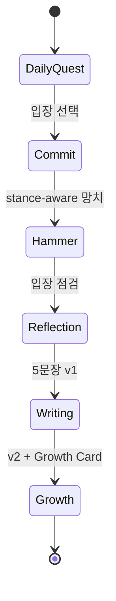

# GIST EDU PLAYBOOK v1

> **버전:** Sprint 0.5 · 2026-06-08  
> **상태:** LOCKED 원칙 + Sprint 1 진입 전 운영 가이드  
> **관련:** [`GIST_EDU_QUEST_SEED_20.md`](GIST_EDU_QUEST_SEED_20.md) · [`GIST_EDU_TIER_SPEC.md`](GIST_EDU_TIER_SPEC.md) · [`GIST_EDU_DESIGN_SYSTEM.md`](GIST_EDU_DESIGN_SYSTEM.md) · [`GIST_EDU_ARTICLE_POOL.md`](GIST_EDU_ARTICLE_POOL.md)

---

## 0. 디자인 LOCKED

- **학생·앱 UI:** g. B&W ([`public/favicon-G.svg`](../public/favicon-G.svg)) — 블랙 `#000000` & 화이트 only
- **부모 리포트 PDF:** Editorial Orange v3.1 ([`public/favicon-G-edu.svg`](../public/favicon-G-edu.svg), `#f05123`, g. **78px**, Share Card)
- 상세: [`GIST_EDU_DESIGN_SYSTEM.md`](GIST_EDU_DESIGN_SYSTEM.md) §2 (UI) · §7 (PDF)

---

## 1. 제품 정의 (4관점)

| 대상 | 한 줄 정의 |
|------|------------|
| **학생** | 오늘의 퀘스트 1개로 내 생각을 만들고 GIST Challenger를 향해 성장하는 서비스 |
| **부모** | 아이의 생각이 깊어지는 과정을 월간 리포트로 확인하는 서비스 |
| **학원** | 매일 시사 논술 소재와 초안 생성을 자동화하는 서비스 |
| **the gist** | 대한민국 청소년 사고 데이터 플랫폼 |

> **퀘스트 = 유입 · 티어 = 유지 · 부모 리포트 = 결제 이유** — 부모가 돈을 내는 순간은 "Gold가 됐네"가 아니라 "한 달 전보다 생각하는 방식이 달라졌네"를 느끼는 때다.

**내부 엔진:** the gist published 기사를 원료로, **탐구 OS / 퀘스트 엔진**이 하루 한 쟁점을 Commit → Hammer → Reflection → Writing → Growth로 이끈다. 기사는 트리거, **사고 로그·글쓰기 성장**이 자산이다. 본질은 **v1 → 반론 → v2**.

---

## 2. 코어 READ ONLY 절대 원칙

| 금지 | 허용 |
|------|------|
| `news` INSERT/UPDATE/DELETE | published `news` SELECT |
| `analysis_embeddings` 쓰기 | 벡터 검색 READ |
| `public/api/search.php` 등 코어 PHP **변경** | `partner/rag-query.php` READ 호출 |
| Admin `generate`·임베딩 재생성 | Sprint 0: `docs/*`, `tools/*` read-only 스크립트 |

**Sprint 0 실적:** 코어 코드/스키마 변경 **0건** 목표.

**아키텍처 (Sprint 1+):** `edu.thegist.co.kr` BFF + `edu_*` 테이블만 WRITE. 코어와 동일 EC2/Supabase/OpenAI 공유 가능하나 **데이터 경계 분리**.

---

## 3. 퀘스트 생성 규칙 (LOCKED)

| 조건 | 규칙 |
|------|------|
| **트리거** | GIST **published** 기사만 |
| **금지** | 교복·휴대폰·게임·등교시간 등 **지엽적 일상 쟁점** |
| **최소 기사** | 동일 주제 **3건+** (`manual_arc` 또는 Sprint 1+ `issue_arc_id`) |
| **구조 신호** | 기사 간 **일치·불일치** (`alignment_summary` / `conflict_summary`) |
| **확정** | **human approve** — Sprint 0 자동 생성 금지 |
| **역할 태그** | `primary` / `context` / `counter` |
| **학년** | `grade_band`: middle / high — Tier와 별개 (읽기 adaptation) |

**검증 경로:**
1. 수동: 3건 읽고 일치/불일치 한 줄
2. READ: `partner/rag-query` `include_analysis:true` → `alignment_points` / `conflict_points`

**현재 approve 세트:** 20건 — [`GIST_EDU_QUEST_SEED_20.md`](GIST_EDU_QUEST_SEED_20.md) v2

### 전국 퀘스트 원칙 (Sprint 1+ 선행 조건)

**허용:**
- 전국 참여 N명, 찬성/반대 %, 입장 변경 %, 티어별 평균 수정률

**금지:**
- 전국 1등·2등·개인 순위 리더보드
- 상위 1% 하이라이트

교육 서비스를 랭킹 게임으로 만들면 상위 1%를 제외하고 이탈한다. 집계·분포만 노출한다.

---

## 4. FSM — Commit → Hammer → Reflection → Writing → Growth



| 단계 | 목적 | RAG |
|------|------|-----|
| **Daily Quest** | 쟁점·pro/con 노출 | ❌ (시드 데이터) |
| **Commit** | 입장 1줄 | ❌ |
| **Hammer** | 반대 근거 노출 | ✅ stance-aware, 챗봇 ❌ |
| **Reflection** | 입장 수정·연결 | ✅ 제한적 프롬프트 |
| **Writing** | 5문장 + 근거·반론 | ✅ 인용 보조 |
| **Growth** | v1→v2, 카드 | ❌ (로그 기반) |

**기사 UI 공개 시점:** CEO 확정 대기 (Sprint 0 범위 밖). 원문 노출은 Tier·단계별 scaffolding 정책으로 Sprint 1 설계.

### 학생 UI 4스텝 (Sprint 1 표시 가이드)

내부 엔진 5단은 유지하되, 학생 화면은 아래 4스텝으로 단순 표시한다:

```
찬반 선택 → 반론 읽기 → 5문장 쓰기 → XP·티어
```

Reflection은 Hammer 직후 **인라인 질문 1개**로 흡수한다.

### "3분" 문구 분리 (카피 vs KPI)

| 용도 | 허용 |
|------|------|
| 학생 마케팅 카피 | "3분이면 오늘의 입장을 말할 수 있어요" |
| 제품 KPI·XP 보너스 | **금지** (속도·완료 시간 추적 금지) |

---

## 5. Tier 7 요약 (메달 체계 v2)

| # | Tier |
|---|------|
| 1 | Observer |
| 2 | Iron |
| 3 | Bronze |
| 4 | Silver |
| 5 | Gold (골드 사상가) |
| 6 | Platinum |
| 7 | **GIST Challenger** |

**UI:** `TierProgressCard` — 랭크 · XP 바 · 연속일 · (학생) 오늘의 퀘스트 CTA  
**부모:** 승급 알림 · Challenger 달성 알림 — [`GIST_EDU_PARENT_REPORT_SAMPLES.md`](GIST_EDU_PARENT_REPORT_SAMPLES.md)

**LOCKED:** 승급만 허용 · **강등 금지** · 비활성 시 `status: dormant` (티어 유지)

상세: [`GIST_EDU_TIER_SPEC.md`](GIST_EDU_TIER_SPEC.md)

---

## 6. KPI (Sprint 0 확정)

| KPI | 사용 | 비고 |
|-----|------|------|
| **1세트 완료율** | ✅ | Commit→Growth 완주 |
| **Writing v1→v2율** | ✅ | 구조·근거 개선 |
| **3분 완료 목표** | ❌ **금지** | 속도 KPI는 품질 훼손 (카피만 허용) |
| **부모 질적 성장 지표** | ✅ (월간) | 구조화·근거·반론 수용 — 숫자 Index **금지** |
| **퀘스트 approve 품질** | ✅ | 3건+ · conflict 필수 |

### 학생 실제 문장 우선 (LOCKED)

부모·공유 화면에서는 XP·근거 횟수·입장 수정 횟수보다 **학생이 직접 쓴 한 문장**(Writing v2 또는 입장 정교화 문장)을 전면에 배치한다. 숫자는 보조(티어 바 하단·내부 로그)로만 사용한다.

---

## 7. Sprint 0 → Sprint 1 게이트 체크리스트

| # | 항목 | Sprint 0 산출 | 상태 |
|---|------|---------------|------|
| 1 | 퀘스트 20 approved, GIST 3건+ | `GIST_EDU_QUEST_SEED_20.md` | ✅ |
| 2 | conflict_summary + article_ids + role | 동일 | ✅ |
| 3 | 부모 샘플 5 | `GIST_EDU_PARENT_REPORT_SAMPLES.md` | ✅ |
| 4 | PLAYBOOK v1 + Tier spec | 본 문서 + `GIST_EDU_TIER_SPEC.md` | ✅ |
| 5 | 코어 변경 0건 | git diff 코어 경로 | ✅ (문서만) |
| 6 | 부모 인터뷰 ≥3/5 긍정 | 운영 | ⏳ |
| 7 | `edu_*` DDL / edu API | Sprint 1 | — |

**GO 조건:** 1~5 ✅ + (6 완료 또는 학원 PT 동의)  
**NO-GO:** 6 실패 시 콘텐츠·부모 가치 재설계 후 재게이트

상세 게이트: [`GIST_EDU_SPRINT0_GATE.md`](GIST_EDU_SPRINT0_GATE.md)

---

## 8. 에이전트·RAG 원칙 (요약)

| 에이전트 | Sprint 0 | Sprint 1+ |
|----------|----------|-----------|
| Quest | 시드 20 (human) | Orchestrator |
| Socratic / Hammer / Reflection / Writing | 규칙 문서화 | BFF LLM |
| Growth Card / Parent Engine | 샘플 5 | Sprint 2+ |

**RAG:** 자유 챗봇 패턴 금지. `alignment_points` / `conflict_points` 구조 인용. Partner v2 우선.

---

## 9. GTM (참고)

1. **Sprint 0:** 콘텐츠·부모 가치 검증 (본 플레이북)
2. **Sprint 1:** edu BFF + 파일럿 학원 1곳 — [`GIST_EDU_PILOT_ACADEMY.md`](GIST_EDU_PILOT_ACADEMY.md)
3. **Sprint 2+:** 부모 리포트 자동화 · 학원 확장

---

## 10. 의도적 보류

- `issue_arc_id` DB 컬럼 — Sprint 0은 `manual_arc`
- 기사 공개 UX — CEO 확정
- B-auto 퀘스트 생성 — approve 20 + 루브릭 기록 후 Sprint 1
- XP·Tier DB — 정의만 완료

---

*v1 — Sprint 0 완료 시점 기준. 코어 팀 승인 없이 코어 WRITE 경로 추가 금지.*
