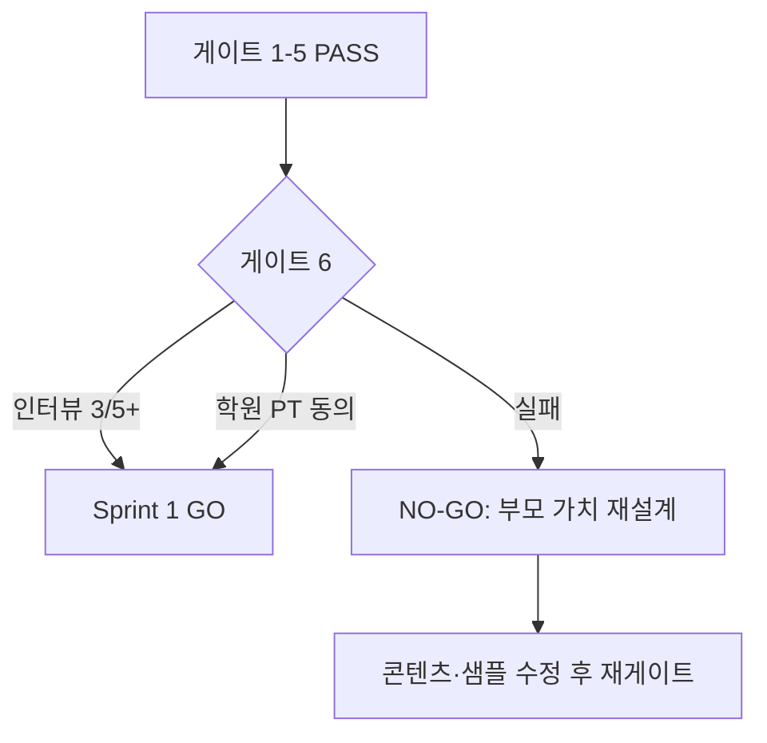

# GIST EDU Sprint 0 — 완료 게이트 리뷰

> **일자:** 2026-06-08 (Sprint 0.5 피드백 반영)  
> **목적:** Sprint 1 (edu DDL · BFF · 파일럿 UI) **GO / NO-GO**  
> **원칙:** 코어 READ ONLY 유지 검증 포함

---

## Executive Summary

| 판정 | 내용 |
|------|------|
| **콘텐츠 게이트 (1~5)** | **PASS** — 산출물 7종 완료, 퀘스트 20 approved |
| **수요 게이트 (6)** | **PENDING** — 부모 인터뷰 3~5명 미실시 (운영 항목) |
| **Sprint 1 권고** | **조건부 GO** — 인터뷰 또는 학원 PT 동의 후 착수 |

---

## 게이트 체크리스트

### 필수 (Sprint 1 진입)

| # | 체크 | 증거 | 결과 |
|---|------|------|------|
| **1** | 퀘스트 20 approved, 전부 GIST 3건+ | [`GIST_EDU_QUEST_SEED_20.md`](GIST_EDU_QUEST_SEED_20.md) — Q-G01~G20, `status: approved` | ✅ PASS |
| **2** | 각 퀘스트 `conflict_summary` + `article_ids` + role | 동일 파일 게이트 표 | ✅ PASS |
| **3** | 부모 샘플 5 (Tier 카드·알림 + Growth + Writing + 질적 지표) | [`GIST_EDU_PARENT_REPORT_SAMPLES.md`](GIST_EDU_PARENT_REPORT_SAMPLES.md) · B&W PDF (Index 숫자 제거) | ✅ PASS |
| **4** | PLAYBOOK v0.5 + Tier spec + Design system | [`GIST_EDU_PLAYBOOK.md`](GIST_EDU_PLAYBOOK.md) · [`GIST_EDU_TIER_SPEC.md`](GIST_EDU_TIER_SPEC.md) · [`GIST_EDU_DESIGN_SYSTEM.md`](GIST_EDU_DESIGN_SYSTEM.md) | ✅ PASS |
| **5** | 코어 코드/스키마 변경 0건 | Sprint 0 작업 = `docs/*` + `tools/_s0_*` READ 스크립트만 | ✅ PASS |
| **6** | 부모 인터뷰 긍정 ≥3/5 (또는 학원 PT 동의) | 아래 §인터뷰 프로토콜 | ⏳ PENDING |

### Sprint 1 범위 (게이트 아님)

| # | 항목 | 상태 |
|---|------|------|
| 7 | `edu_*` DDL / edu API | Sprint 1 작업 |

---

## Sprint 0 산출물 인덱스

| ID | 산출물 | 파일 |
|----|--------|------|
| S0-1 | 기사 풀 + manual_arc 15 | [`GIST_EDU_ARTICLE_POOL.md`](GIST_EDU_ARTICLE_POOL.md) |
| S0-2 | 일치·불일치 검증 | [`GIST_EDU_ARC_ALIGNMENT.md`](GIST_EDU_ARC_ALIGNMENT.md) |
| S0-3 | 퀘스트 20 v2 approved | [`GIST_EDU_QUEST_SEED_20.md`](GIST_EDU_QUEST_SEED_20.md) |
| S0-4 | Tier 7 메달 체계 + Design | [`GIST_EDU_TIER_SPEC.md`](GIST_EDU_TIER_SPEC.md) · [`GIST_EDU_DESIGN_SYSTEM.md`](GIST_EDU_DESIGN_SYSTEM.md) |
| S0-5 | 부모 샘플 5 + PDF | [`GIST_EDU_PARENT_REPORT_SAMPLES.md`](GIST_EDU_PARENT_REPORT_SAMPLES.md) · `exports/gist-edu/parent-reports/` |
| S0-6 | PLAYBOOK v0.5 | [`GIST_EDU_PLAYBOOK.md`](GIST_EDU_PLAYBOOK.md) |
| S0-8 | Sprint 0.5 피드백 반영 | Dormant·질적 지표·4관점 정의·전국 랭킹 금지 |
| S0-7 | 게이트 리뷰 | 본 문서 |

**READ 도구 (코어 미변경):** `tools/_s0_search_body_*.json`, `tools/_s0_search_result_*.json`, `tools/_s0_build_pool.py`, `tools/_s0_build_alignment.py`

---

## 퀘스트 20 품질 감사 (요약)

| 지표 | 값 |
|------|-----|
| approved | 20/20 |
| middle : high | 10 : 10 |
| article_ids ≥3 | 20/20 |
| conflict_summary 비어 있지 않음 | 20/20 |
| 지엽 일상 쟁점 | 0 |
| manual_arc 커버 | 15 arc 중 12 arc 사용 (일부 arc 2퀘스트) |
| 루브릭 합계 ≥12 | 20/20 |

---

## 코어 안전성 확인

| 항목 | Sprint 0 |
|------|----------|
| `news` 쓰기 | 없음 |
| 코어 PHP 변경 | 없음 |
| OpenAI 비용 | production `search.php` READ 소량 |
| 롤백 비용 | 문서 폐기만 — 코드 부채 없음 |

---

## 부모 인터뷰 프로토콜 (게이트 #6)

**대상:** 학부모 3~5명 (파일럿 학원 네트워크 또는 지인)

**자료:** Editorial Orange v3.1 PDF 5종 — `docs/exports/gist-edu/parent-reports/`  
재생성: `php tools/generate_edu_parent_report_pdfs.php`

**v3.1 변경 사항 (인터뷰 시 안내):**
- **Share Card** — "이번 달 가장 큰 변화" (before → after, 캡처·공유용)
- **이번 달 처음 생긴 변화** — stat KPI 대신 부모 친화 문장
- **한 줄 평가** — 2문장, 한글 정상 (italic 제거)
- 티어 **맨 아래** — 성장 스토리 후 "그래서 Gold"
- 부모 리포트 = **결제 이유** (퀘스트=유입, 티어=유지)

**질문 3개:**
1. “이 리포트만 받는다면 월 ○○원 가치가 있나요?” (예/아니오)
2. “자녀의 **글쓰기 성장 스토리**가 보이나요?” (1~5)
3. “지스트 뉴스와 다른 점이 느껴지나요?” (자유 응답)

**추가 관찰 (선택):**
4. “숫자 점수 없이 구조화·근거·반론 관찰이 이해하기 쉬운가요?” (1~5)

**통과:** Q1 **긍정 3/5 이상** 또는 파일럿 학원 **서면 PT 동의**

**기록 템플릿:**

| # | 일자 | 긍정(Q1) | Q2 평균 | 비고 |
|---|------|----------|---------|------|
| 1 | | | | |
| 2 | | | | |
| 3 | | | | |
| 4 | | | | |
| 5 | | | | |

---

## Sprint 1 GO / NO-GO 결정

| 시나리오 | 결정 |
|----------|------|
| **A** — 1~5 ✅, 인터뷰 3/5+ | **GO** — Sprint 1 DDL + edu BFF + 파일럿 1학원 |
| **B** — 1~5 ✅, 학원 PT 동의 | **GO** (인터뷰 병행 권장) |
| **C** — 1~5 ✅, 인터뷰 실패 | **NO-GO** — 부모 샘플·퀘스트 삶연결 재작업 |
| **D** — 코어 변경 발생 | **NO-GO** — 롤백 후 재검증 |

**현재 (2026-06-08):** 시나리오 **B GO** — v3.1 최종 LOCKED (학생 실제 문장 우선 원칙 반영). Sprint 1 착수. 게이트 #6 부모 인터뷰는 파일럿 PT와 **병행**.

---

## Sprint 1 착수 시 첫 작업 (참고)

1. `edu_daily_quests` DDL + approve 20 JSON 적재
2. `edu.thegist.co.kr` BFF 스켈레톤 (코어 경로 분리)
3. 파일럿 학원 1곳 — Q-G01, Q-G05, Q-G14 주간 로테
4. Partner RAG 키 edu BFF 환경변수 (READ only)

---

## 미결정 항목 (CEO/운영)

| # | 항목 | Sprint 0 권고 |
|---|------|---------------|
| 1 | 퀘스트 middle:high 비율 | **10:10** (파일럿 학년에 맞춰 조정 가능) |
| 2 | 부모 샘플 형식 | **PDF 목업** (결제 검증용) |
| 3 | 기사 공개 UX 시점 | Sprint 1 설계에서 CEO 확정 |

---

*Sprint 0 에이전트 산출 완료. 게이트 #6은 운영팀 실행.*
