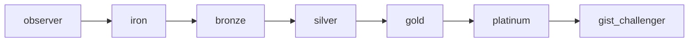

# GIST EDU — Tier 7단계 정의 (v2 · 메달 체계)

> **상태:** LOCKED (Sprint 0) · v1 분석 슬롯명(Noticer/Thinker 등) **폐기**  
> **디자인:** [`GIST_EDU_DESIGN_SYSTEM.md`](GIST_EDU_DESIGN_SYSTEM.md) — g. · 블랙 & 화이트  
> **구현:** XP·DB는 Sprint 1+

---

## 한 줄 정의

Tier는 학생의 **탐구 성숙도·누적 사고 로그**를 나타내는 7단계 메달 랭크다. 최종 **GIST Challenger**는 GIST가 인정하는 최고 등급이다.

---

## 7단계 (LOCKED)

| # | `tier_id` | EN | KO (부제) | XP 구간 (Sprint 0 가상) |
|---|-----------|-----|-----------|-------------------------|
| 1 | `observer` | Observer | 관찰자 | 0 – 299 |
| 2 | `iron` | Iron | 아이언 | 300 – 599 |
| 3 | `bronze` | Bronze | 브론즈 | 600 – 899 |
| 4 | `silver` | Silver | 실버 | 900 – 1,199 |
| 5 | `gold` | Gold | 골드 사상가 | 1,200 – 1,799 |
| 6 | `platinum` | Platinum | 플래티넘 | 1,800 – 2,499 |
| 7 | `gist_challenger` | GIST Challenger | GIST 챌린저 | 2,500+ |



**`grade_band`** (middle/high)는 읽기 adaptation 축 — Tier와 **별개**. 학생·부모 UI에는 **노출하지 않음** ([`GIST_EDU_DESIGN_SYSTEM.md`](GIST_EDU_DESIGN_SYSTEM.md) 참고).

---

## 티어 상태 (LOCKED)

| 규칙 | 내용 |
|------|------|
| **승급** | XP 누적 시만 — `tier_id` 상향 |
| **강등** | **금지** — `tier_id` 하향 변경 없음 |
| **비활성** | `status: dormant` — 티어 유지, 스트릭·XP 진행 정지 |
| **복귀** | 퀘스트 1세트 완료 (Commit→Growth) 시 `status: active` |

강등 대신 Dormant를 사용한다. Gold → Silver처럼 하향하면 학생 이탈·학원 민원이 발생하므로, **티어는 유지하고 활동 상태만 변경**한다.

### Dormant JSON 예시

```json
{
  "tier_id": "gold",
  "tier_label_en": "Gold",
  "tier_label_ko": "골드 사상가",
  "status": "dormant",
  "dormant_since": "2026-05-28",
  "xp_current": 1440,
  "streak_days": 0
}
```

학생 UI 표시 예: `Gold (골드 사상가) · 상태: Dormant`

---

## TierProgressCard (학생·부모 UI)

### 표시 규칙

- 현재 티어: `{tier_label_en}` + `({tier_label_ko})`
- 상태: `active` (기본) 또는 `dormant` — 강등 표시 **금지**
- 진행률: 다음 티어까지 `progress_pct` (최고 Tier 7은 100% 또는 배지만)
- XP: `xp_current` / `{next_tier_label}: {xp_next_tier}`
- 연속: `{streak_days}일 연속`
- 학생 화면 하단: `오늘의 퀘스트 → [시작]`
- **학년·학교급 노출 금지** — 중1/고1 등 표시하지 않음. 정체성은 티어 + XP + 연속일만

### JSON 스키마

```json
{
  "tier_id": "gold",
  "tier_label_en": "Gold",
  "tier_label_ko": "골드 사상가",
  "next_tier_id": "platinum",
  "next_tier_label_en": "Platinum",
  "xp_current": 1440,
  "xp_next_tier": 1800,
  "progress_pct": 64,
  "streak_days": 12,
  "show_quest_cta": true
}
```

---

## XP 적립 (Sprint 1 설계 참고)

| 행동 | XP (예시) |
|------|-----------|
| 퀘스트 1세트 완료 (Commit→Growth) | +80 |
| Writing v1→v2 개선 | +40 |
| 입장 수정 (refined/flipped) | +20 |
| 근거 인용 (기사 news_id) | +15 |

**금지:** 3분 완료·속도 보너스 KPI

---

## 부모 알림 템플릿

**LOCKED:** 알림 본문은 **학생이 직접 쓴 한 문장**을 선행한다. `stance_changes`·`evidence_cites` 등 숫자는 보조 1줄로만.

### A) 승급 (`event: tier_promotion`)

```json
{
  "event": "tier_promotion",
  "tier_id": "gold",
  "tier_label_en": "Gold",
  "hero_sentence": "그래서 나는 전면 규제가 아니라 재교육·안전망 쪽에 찬성한다.",
  "stats_window": "6주",
  "stance_changes": 5,
  "evidence_cites": 15,
  "body": "민준이가 Gold가 됐습니다. 이번 달 직접 쓴 문장 — \"그래서 나는 전면 규제가 아니라 재교육·안전망 쪽에 찬성한다.\" 지난 6주 동안 입장을 5번 바꾸고 근거를 15번 인용했습니다."
}
```

### B) GIST Challenger (`event: gist_challenger`)

```json
{
  "event": "gist_challenger",
  "hero_sentence": "AI 보조는 생산성에 도움이 되지만, 최종 판단과 책임은 사람에게 있어야 한다.",
  "stats_window": "2년",
  "stance_changes": 120,
  "quests_completed": 10,
  "body": "하은이가 GIST Challenger가 됐습니다. 직접 쓴 문장 — \"AI 보조는 생산성에 도움이 되지만, 최종 판단과 책임은 사람에게 있어야 한다.\" GIST가 인정하는 최고 등급입니다. 2년간 입장을 120번 수정하고 전국 퀘스트를 10번 완주했습니다."
}
```

---

## 부모 리포트 배치

1. **TierProgressCard** — 주간 스냅샷 (항상)
2. **ParentAlert** — 해당 주 승급·Challenger 달성 시에만
3. Growth Card · Writing Growth · 질적 성장 지표 (숫자 Index 금지)

---

## v1 폐기 안내

| v1 (폐기) | v2 |
|-----------|-----|
| Observer~Thinker 분석 슬롯 7단계 | 메달 7단계 (위 표) |
| 퀘스트 내 슬롯 깊이 | Sprint 1 FSM 루브릭으로 별도 정의 |

---

*Sprint 1: `edu_user_tier` · XP 엔진 · Parent Engine 푸시*
