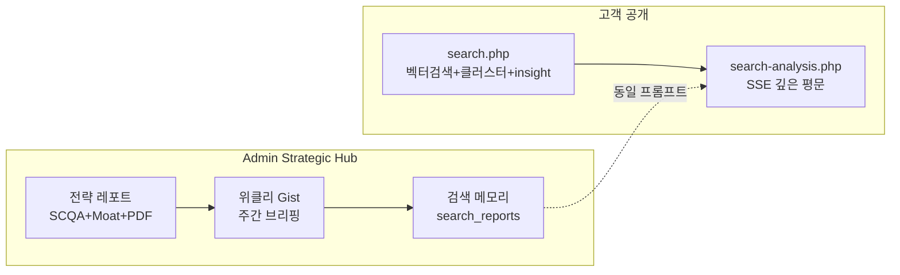
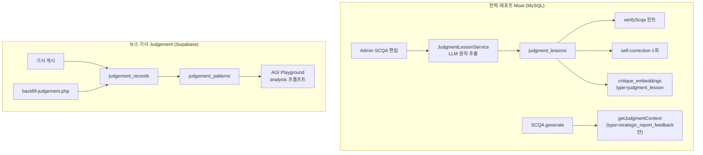

# Intelligence 기능 사용법 · 기대 출력 · Judgment · 학습 가이드

> **전제:** Intelligence Admin 기능(전략 레포트·위클리 Gist·검색 메모리)은 **고객 미공개**. 고객에게 열린 것은 **검색(L1~2 + insight 배너 + SSE 클러스터 분석)** 뿐입니다.

---

## 1. 전체 구조



| Surface | 진입 | 데이터 소스 | 저장 |
|---------|------|-------------|------|
| **고객 검색** | `/search?q=` | `analysis_embeddings` + MySQL `news` | 없음 (세션 UI) |
| **위클리 Gist** | Admin → Strategic Hub → 위클리 | the gist published 기사 | `weekly_gist_reports` |
| **전략 레포트** | Admin → Strategic Hub → 전략 | `intelligence_source_items` + gist 앵커 | `weekly_strategic_reports` |
| **검색 메모리** | Admin → Strategic Hub → 검색 메모리 | 고객 검색과 동일 분석 | `search_reports` |

공통 깊이 기준: [`config/narrative_depth.php`](../config/narrative_depth.php) — synthesis ≥1200자, cluster narrative ≥600자, depth_pass_threshold 0.7

---

## 2. 고객 검색 (유일한 공개 Intelligence)

**진입:** [`SearchPage.tsx`](../src/frontend/src/pages/SearchPage.tsx) — `https://www.thegist.co.kr/search?q=키워드`

### 2-A. Layer 1~2 — `POST /api/search.php`

**요청:**

```json
{ "query": "우크라이나", "limit": 20, "category": null }
```

**기대 출력:**

- `results[]`: 벡터 유사도 순 기사 (title, entities, topic_label, similarity …)
- `clusters[]`: 2~3개 주제 클러스터 (`name`, `question`, `article_indices`, `hero_index`)
- `insight`: 결과 2건 이상일 때 **1문장** AI 인사이트 (GPT 실패 시 `null`)
- UI: **「AI 인사이트」** 배너가 클러스터 탭 **위**에 표시

**기대 UX:** 검색 → 관련 기사 카드 + 주제별 클러스터 제안 → insight로 한 줄 맥락

### 2-B. Layer 3 — `POST /api/search-analysis.php` (SSE)

**요청:**

```json
{ "news_ids": [294, 87, 336], "cluster_name": "우크라이나 전쟁이 유럽..." }
```

**SSE 이벤트:**

| event | 의미 |
|-------|------|
| `start` | `{ cluster_name, article_count }` |
| `token` | `{ text: "..." }` — 스트리밍 델타 |
| `done` | `{ full_text: "..." }` |
| `end` | 종료 |

**기대 출력 (평문, JSON 아님):**

- 「1. 핵심 결론」→ 「2. 관점 비교 분석」→ 「3. 시사점」 3단 구조
- 충분한 분량 (max_tokens search: 2000, [`narrative_depth.php`](../config/narrative_depth.php))
- Judgment lesson 힌트·외부 intel 주입 가능 ([`SearchAnalysisService.php`](../src/backend/Services/SearchAnalysisService.php))

**저장 없음** — Admin이 복사해 검색 메모리에 저장해야 영구화

---

## 3. Admin Strategic Hub — 3탭 사용법

**진입:** Admin 로그인 → [`AdminPage.tsx`](../src/frontend/src/pages/AdminPage.tsx) → **Strategic Hub** ([`StrategicHub.tsx`](../src/frontend/src/components/Admin/StrategicHub.tsx))

### 3-A. 전략 레포트 ([`StrategicReports.tsx`](../src/frontend/src/components/Admin/StrategicReports.tsx))

**API:** [`strategic-reports.php`](../public/api/admin/strategic-reports.php) — **주의: 현재 JWT admin gate 없음** (무인증 list/detail 200 가능). 운영 전 `requireAdminApi` 추가 권장.

#### 운영 플로우

1. **(선택) 수집** — `POST { action: "collect" }`  
   NYT/Guardian/RSS → `intelligence_source_items` 적재

2. **(선택) 재임베딩** — `POST { action: "reprocess", limit: 80 }`  
   pending/failed embed 처리

3. **레포트 생성** — `POST { action: "generate", report_week?: "2026-W23" }`  
   - Weekly Gist 앵커 + 외부 intel 매칭  
   - SCQA JSON 생성 → verifyScqa → (필요 시) 1회 self-correction  
   - `prediction_outcomes` 자동 동기화

4. **상세 검토** — `GET ?action=detail&id=`  
   - `scqa_raw_json` / `scqa_edited_json`  
   - `meta_json.verification`: `depth_score`, `depth_passed`, `lesson_violations`, `confidence_score`  
   - `prediction_outcomes[]`: 시나리오별 pending

5. **human edit + Judgment 학습** — `POST { action: "update", id, scqa_edited_json, edit_reason?, judgment_feedbacks? }`  
   - diff → **Lesson Card 자동 추출** (아래 Judgment 섹션)  
   - cosmetic 편집(meta, executive_summary만)은 lesson 제외

6. **승인** — `POST { action: "update_status", status: "approved" }`

7. **배포** — PDF preview/export, Resend 이메일 (`approved`만)

#### Judgment Moat 패널 (UI)

- **Lessons** — `GET ?action=lessons` → `judgment_lessons` 규칙 목록 (frequency, status: rag/promoted)
- **Calibration** — `GET ?action=calibration_summary` → hit/miss/partial/pending 집계
- **예측 채점** — `POST { action: "score_predictions", report_id, scores: [{ id, outcome_status: "hit"|"miss"|"partial", outcome_notes? }] }`

#### 기대 SCQA 출력 ([`StrategicReportSchema.php`](../src/backend/Config/StrategicReportSchema.php))

핵심 필드:

- `core_question`, `synthesis_narrative` (≥1200자), `executive_summary`
- `structural_shift`: headline, from_pattern, to_pattern, why_now
- `situation`, `complication` (narrative_collisions, perspectives)
- `answer.scenarios[]`: `prediction_signal`, `probability`, `outcome`, `action_matrix`
- `meta.confidence`: high|medium|low

**검증 메타 예시** (`meta_json.verification`):

```json
{
  "depth_score": 0.308,
  "depth_passed": false,
  "confidence_score": 0.72,
  "lesson_count": 2,
  "lesson_violations": ["[Lesson #3] 확률 75% 이상 시 '반드시' 금지"],
  "critique_grounding": 1
}
```

---

### 3-B. 위클리 Gist ([`WeeklyGist.tsx`](../src/frontend/src/components/Admin/WeeklyGist.tsx))

**API:** [`weekly-gist.php`](../public/api/admin/weekly-gist.php) — **JWT admin 필수**

#### create 플로우 (3단계)

1. **기간 조회** — `GET ?action=articles&start=2026-05-26&end=2026-06-01`  
   published the gist 기사 + RAG 메타

2. **기사 선택 (≥3)** → **생성** — `POST { action: "generate", start, end, articles: [{ id, title, ... }] }`

3. **결과 확인·편집·저장** — GistViewer에서 JSON 편집 → `POST { action: "update_gist", id, gist }`

#### library 플로우

- `GET ?action=list` → 항목 클릭 → `GET ?action=detail&id=` → 재편집

#### 기대 `gist` JSON ([`WeeklyGistService.php`](../src/backend/Services/WeeklyGistService.php))

```json
{
  "headline": "30자 이내",
  "synthesis_narrative": "≥1200자, 3문단",
  "macro_so_what": "200자+",
  "clusters": [{
    "cluster_id": 1,
    "title": "",
    "narrative": "600~1200자",
    "one_line_takeaway": "",
    "source_article_ids": [12, 45],
    "perspectives": [{ "viewpoint", "source", "difference_reason" }],
    "so_what": { "implication", "why_it_matters", "what_to_watch": [] }
  }],
  "cross_connections": [],
  "next_week_watch": [],
  "meta": { "depth": { "depth_passed", "depth_score" } }
}
```

**역할:** 주간 the gist 기사를 **클러스터 브리핑**으로 묶고, 이후 검색 메모리 Memory Diff의 **과거 프레이밍 기준점**이 됨

---

### 3-C. 검색 메모리 ([`SearchMemory.tsx`](../src/frontend/src/components/Admin/SearchMemory.tsx))

**API:** [`search-reports.php`](../public/api/admin/search-reports.php) — **JWT admin 필수**

#### 3개 탭

| 탭 | 용도 | API |
|----|------|-----|
| **library** | 저장된 분석 목록·상세·편집 | `list`, `detail`, `POST update` |
| **memory** | Gist와 entity/topic 비교 (저장 없음) | `GET memory_diff&news_ids=1,2,3&cluster_name=...` |
| **create** | AI 생성+저장 또는 수동 저장 | `POST generate` / `POST save` |

#### Memory Diff 기대 출력 ([`StrategicMemoryService.php`](../src/backend/Services/StrategicMemoryService.php))

**매칭 성공** (`matched: true`, combined_score ≥ 0.12):

```json
{
  "matched": true,
  "diff_summary": "2주 전 Gist에서는 X였으나, 이번 검색 클러스터는 Y로 프레이밍",
  "gist_report_id": 3,
  "gist_period": "2026-05-19 ~ 2026-05-25",
  "framing_then": "Gist one_line_takeaway",
  "framing_now": "현재 cluster_name",
  "overlap": { "entities": [], "topic_labels": [], "combined_score": 0.18 }
}
```

**미매칭:** `matched: false`, `gist_report_id: null` — `weekly_gist_reports` 0건이면 diff 불가

#### create — generate vs save

- **generate:** `POST { action: "generate", news_ids, cluster_name, search_query?, cluster_question? }`  
  → `SearchAnalysisService` (고객 SSE와 **동일 프롬프트**) → DB 저장 + memory_diff 스냅샷 in `meta`

- **save:** 고객 UI에서 복사한 `analysis_text` + ids → human-in-the-loop 저장

---

## 4. Judgment Moat — 현재 어떻게 동작하는가

코드베이스에 **Judgment가 2축**으로 존재합니다. **서로 아직 통합되지 않음.**



### 4-A. 전략 레포트 Moat (핵심)

**파일:** [`JudgmentLessonService.php`](../src/backend/Services/JudgmentLessonService.php), [`StrategicReportService.php`](../src/backend/Services/StrategicReportService.php)  
**설정:** [`config/judgment_lessons.php`](../config/judgment_lessons.php)

| 단계 | 동작 | 트리거 |
|------|------|--------|
| **Lesson 추출** | 편집 diff → GPT-4o-mini → `rule`, `error_type`, `scqa_section` | SCQA `update` 저장 시 **자동** |
| **Cosmetic 필터** | meta.*, executive_summary만 변경 → **학습 제외** | 자동 |
| **승격** | 동일 rule 3회 누적 → `status: promoted` | 자동 |
| **verifyScqa 주입** | promoted/rag lesson → violation hints → confidence -0.08 | SCQA generate/verify 시 **자동** |
| **Self-correction** | confidence<0.6 OR lesson_violations OR depth fail → **1회** 재생성 | 자동 |
| **예측 동기화** | scenarios → `prediction_outcomes` pending | 레포트 저장 시 **자동** |
| **예측 채점** | hit/miss/partial | **수동** (Admin UI) |

**error_type 예:** `확신_과잉`, `출처_누락`, `인과_비약`, `관점_편향`

**현재 프로덕션 상태 (전수 테스트 기준):**

- `judgment_lessons`: **0건** (편집 diff 학습 이력 적음)
- `prediction_outcomes`: 3건 **모두 pending** (채점 전)
- `calibration`: hit=0, miss=0, pending=3
- 레포트 #9: `depth_passed=false`, `depth_score=0.308` — 데이터 품질 이슈, 파이프라인 자체는 동작

### 4-B. 알려진 갭 (운영 시 인지)

1. **RAG 프롬프트 주입 불일치**  
   - 새 lesson은 `critique_embeddings`에 `type: judgment_lesson`으로 저장  
   - `getJudgmentContext()`는 `type: strategic_report_feedback`만 필터 → **생성 프롬프트 RAG 주입이 비어 있을 수 있음**  
   - **실질 lesson 주입은 verifyScqa 구조 태그 매칭**이 핵심 (동작함)

2. **예측 calibration은 관측 전용** — hit rate가 SCQA/검색 프롬프트에 피드백되지 **않음**

3. **검색 SSE는 judgment_lessons와 직접 연결 없음** — [`config/search_analysis.php`](../config/search_analysis.php) + 외부 intel + (별도) judgement_patterns(AGI) 경로

### 4-C. 뉴스 기사 Judgement Layer (별도)

**게시 시 자동:** [`storeJudgementRecord.php`](../public/api/lib/storeJudgementRecord.php) — AI 초안 vs 편집장 최종본 diff → Supabase `judgement_records` + `judgement_patterns`

**용도:** AGI Playground, 기사 분석 품질 — **전략 SCQA Moat와 미연결**

---

## 5. 기존 글 «강제 학습» — 가능한 방법

「강제 학습」은 **자동 fine-tune이 아니라**, 과거 데이터를 Judgment/RAG 저장소에 **백필·편집 루프**로 넣는 것을 의미합니다.

### 5-A. 이미 구현된 방법

| 대상 | 방법 | 도구/경로 | 제한 |
|------|------|-----------|------|
| **뉴스 기사 Judgement** | 배치 백필 | [`backfill-judgement.php`](../public/api/admin/backfill-judgement.php) | GET=통계, POST `{ batch: 10 }` (max 30/회). `analysis_feedback.gpt_analysis` + published `news` → `judgement_records`. Admin JWT 필요 |
| **뉴스 기사 Judgement** | 게시 시 자동 | `news.php` publish → `storeJudgementRecord` | **앞으로** 게시되는 글만 |
| **임베딩 (검색 L1)** | 기사 publish embed | `RAGService::storePublishedArticleEmbedding()` | 검색 벡터 품질 — Judgment lesson과 별개 |
| **외부 intel embed** | 재처리 | `strategic-reports.php` `action=reprocess` | NYT/Guardian RSS items |
| **전략 SCQA Lesson** | Admin 편집 저장 | Strategic Hub → SCQA human edit → `update` | **가장 확실한 Moat 학습**. cosmetic 제외, judgment 경로만 |
| **수동 critique** | critique-api | Admin critique API → `critique_embeddings` | `strategic_report_feedback` 타입이면 SCQA RAG 주입 대상 |
| **AGI Playground** | 수동 패턴 학습 | Admin AGI Lab | `judgement_patterns` 프롬프트 주입 실험 |

**backfill-judgement 운영 예:**

```bash
# 통계
GET /api/admin/backfill-judgement.php

# 10건씩 반복 (Admin Authorization 헤더)
POST /api/admin/backfill-judgement.php
Content-Type: application/json

{ "batch": 10 }
```

### 5-B. 구현되어 있지 않은 방법 (현재 불가)

| 원하는 것 | 상태 |
|-----------|------|
| 과거 SCQA 편집 diff → `judgment_lessons` 일괄 백필 | **스크립트 없음** — 수동으로 레포트 reopen+edit 필요 |
| `judgment_lessons` → 검색 SSE 자동 주입 | **미연결** |
| 예측 hit/miss → 프롬프트 자동 반영 | **미구현** |
| OpenAI fine-tune / 모델 재학습 | **없음** — RAG + rule injection 방식 |
| weekly_gist / search_reports 과거 JSON → lesson 추출 | **없음** |

### 5-C. 기능 향상을 위한 권장 운영 순서

1. **검색 품질:** published 기사 embed 백필 확인 (검색 recall) — 기존 cron/RAG 파이프라인
2. **기사 Judgement:** `backfill-judgement.php` 배치 반복 → AGI/analysis 품질
3. **Moat Lesson (가장 중요):** Strategic Hub에서 SCQA **의도적 human edit** (scenario, collision, perspective) + `edit_reason` / `judgment_feedbacks` 입력 → 3회 누적 시 promoted
4. **예측 calibration:** 주간 레포트 시나리오 **수동 채점** → hit rate 모니터링 (프롬프트 반영은 향후)
5. **Memory Diff 품질:** 위클리 Gist를 **매주 생성·저장** → 검색 메모리 diff 기준점 확보
6. **(향후 개선 후보)** `getJudgmentContext` 필터를 `judgment_lesson` 포함으로 확장, SCQA lesson 백필 CLI

---

## 6. 기능별 «성공» 체크리스트

| 기능 | 성공 기준 |
|------|-----------|
| 고객 검색 | results≥2, insight non-null, clusters 2~3개 |
| SSE 분석 | 3단 평문, 「핵심 결론」 포함, 20~40초 내 완료 |
| 위클리 Gist | synthesis≥1200자, cluster narrative≥600자, depth_passed |
| 전략 SCQA | synthesis_narrative, 3 scenarios, verification 표시 |
| Judgment Lesson | 편집 후 lessons 목록 증가, frequency 누적 |
| Memory Diff | gist 1건+ 있을 때 matched:true, diff_summary 한국어 |
| 예측 calibration | Admin 채점 후 hit/miss 숫자 변화 |

---

## 7. 보안·운영 주의

- [`strategic-reports.php`](../public/api/admin/strategic-reports.php): JWT 없이 list/detail **200** — weekly/search-reports와 불일치. 운영 전 `requireAdminApi` 추가 권장
- GPT generate 실패 시 503 — OpenAI 장애 시 generate smoke SKIP
- Admin Hub 위클리·검색 메모리는 **admin role JWT** 필수

---

## 관련 파일 빠른 참조

| 역할 | 경로 |
|------|------|
| Hub 셸 | `src/frontend/src/components/Admin/StrategicHub.tsx` |
| 고객 검색 UI | `src/frontend/src/pages/SearchPage.tsx` |
| Depth Contract | `config/narrative_depth.php`, `src/backend/Services/NarrativeDepthService.php` |
| Judgment Moat | `src/backend/Services/JudgmentLessonService.php`, `database/migrations/add_judgment_moat.sql` |
| Intelligence bootstrap | `src/backend/bootstrap_intelligence.php` |
| 회귀 CLI | `tools/verify_narrative_depth.php` |
