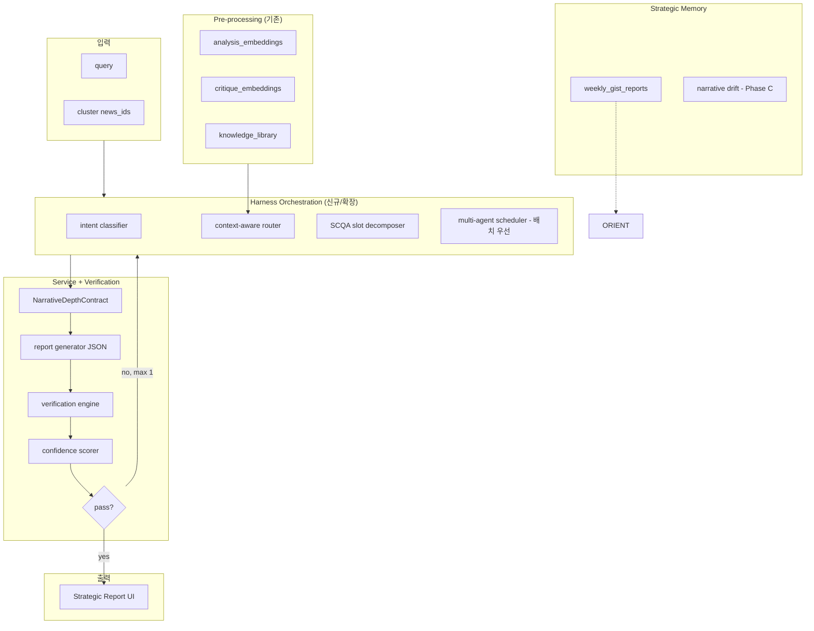

# 뉴스 믹스업 → 전략 레포트 고도화 (KEEP)

> **목적**: 검색 믹스업을 Harness + Multi-Perspective SCQA 기반 **Runtime Intelligence** 로 고도화하기 전, 합의·아키텍처·로드맵·금지사항을 한곳에 보존한다.  
> **상태**: 진행 준비 (구현 전) · **최종 갱신**: 2026-05-19  
> **관련 코드**: `public/api/search.php`, `public/api/search-analysis.php`, `public/api/admin/weekly-gist.php`, `src/frontend/src/pages/SearchPage.tsx`, `src/agents/services/RAGService.php`

---

## 0. 한 줄 정의

| 잘못된 정의 | 맞는 정의 |
|-------------|-----------|
| 뉴스 요약 AI + SCQA 템플릿 + 예쁜 UI | **Harness-based Intelligence Runtime** + **OODA(내부)** + **Multi-Perspective SCQA(외부)** + **Verification** + **Weekly Strategic Memory** |

**포지셔닝 (대외)**: “검증 가능한 전략 브리핑” / “Signal Compression Engine”  
**포지셔닝 (대내)**: 뉴스를 입력으로 의사결정용 전략 프레임을 자동 생성하는 Runtime Intelligence System

**Judgment Engine 철학과의 정합**: AI가 정답을 만드는 것이 아니라, **인간 편집·판단·critique**을 근거로 한 synthesis. `judgement_records`, `analysis_feedback`, `critique_embeddings`를 Grounding의 대체 자산으로 본다.

---

## 1. 현재 구현 스냅샷 (As-Is)

### 1.1 검색 믹스업 파이프라인

```
Header → /search?q=
  → newsApi.semanticSearch → POST /api/search.php
      ① OpenAI embedding
      ② Supabase RPC search_articles_by_embedding
      ③ MySQL news 메타 merge
      ④ GPT 클러스터링 (insight + clusters, gpt-4o-mini)
  → SearchPage: ClusterSection 「이런 주제는 어떠세요?」
  → ClusterCard 클릭
      → newsApi.clusterAnalysis → POST /api/search-analysis.php (SSE 평문)
```

### 1.2 주간 Gist (어드민)

- API: `public/api/admin/weekly-gist.php`
- UI: `src/frontend/src/components/Admin/WeeklyGist.tsx`
- 저장: `weekly_gist_reports` (gist_json, article_ids, update_gist)
- 출력 스키마: clusters, perspectives, so_what, cross_connections, action_hints, macro_so_what, **synthesis_narrative**

### 1.3 갭 (목표 대비)

| 능력 | 상태 |
|------|------|
| Pre-processing (임베딩·메타) | ✅ |
| 검색 + 클러스터 | ✅ |
| 주간 Gist 구조화 리포트 | ✅ (어드민) |
| **전략·위클리 서사 깊이 (검색 수준)** | ✅ `NarrativeDepthService` + `synthesis_narrative` |
| 믹스업 종합 분석 | ⚠️ 평문 SSE만 |
| Verification / confidence | ✅ (전략 SCQA) / ✅ depth gate (위클리) |
| Self-Correction | ✅ (전략 1회, 위클리 1회) |
| 검색 ↔ 주간 메모리 연결 | ❌ |
| Narrative Drift | ❌ |
| Multi-Agent on search path | ❌ |
| search.php `insight` UI 노출 | ❌ |

---

## 2. Harness-Centric AI (PPTX) — 뉴스 도메인 재해석

**원본**: `Harness-Centric-AI.pptx` (6 slides)

### 2.1 3-Layer (코드 매핑)

| Harness Layer | 뉴스 시스템 | 코드 |
|---------------|-------------|------|
| Pre-processing | 기사 게시 시 청킹·임베딩·metadata | `RAGService::storePublishedArticleEmbedding` → `analysis_embeddings` |
| Harness Orchestration | 쿼리 임베딩·RAG·클러스터·라우팅 | `search.php` (+ 신규: intent, agent schedule) |
| Service | 리포트 생성 + **검증 통과 후 전달** | `search-analysis.php` → **verification gate 추가** |

### 2.2 Harness 3대 강점 → 뉴스 적용

| PPTX | 뉴스 적용 | 주의 |
|------|-----------|------|
| Smart Orchestration | RAG·LLM 단일 진입점 (`mixup-report` orchestrator) | 분산 API 정리 |
| Guaranteed Grounding | **확률적 Verification** (110K 금융 실데이터 없음) | “Guaranteed” 마케팅 금지 |
| Universal Agility | Model-agnostic wrapper (후순위) | Phase C |

### 2.3 메커니즘

- **Context-Aware Routing**: 검색 의도 → 템플릿·RAG 소스 선택
- **Self-Correction Loop**: confidence < threshold → 1회 재생성 (필수)
- **Multi-Agent Collaboration**: S/C/Q/A 슬롯 분업 (`src/agents` 활용, **배치·주간 우선**)

### 2.4 핵심 원칙 (PPTX)

> 출력(Report)이 아니라 **시스템(Runtime + Memory + Verification)** 을 납품한다.

---

## 3. 프레임워크 역할 분담 (합의)

**단일 superior 프레임 없음.** 역할별 조합:

| 레이어 | 프레임 | 역할 |
|--------|--------|------|
| **Runtime (내부)** | Intelligence Cycle + OODA | Collection → Processing → Analysis → Dissemination → Feedback |
| **구조화** | MECE | policy / market / geopolitical / supply-chain buckets |
| **출력 (외부)** | **Multi-Perspective SCQA** | 임원·사용자가 읽는 narrative |
| **시간축** | Weekly Gist memory + (Phase C) Narrative Drift | “무엇이 바뀌었는가” |
| **신뢰** | Verification + confidence + human edit | “왜 믿어도 되는가” |

### 3.1 OODA ↔ 믹스업 매핑 (내부 엔진)

| OODA | 동작 |
|------|------|
| **Observe** | semanticSearch 결과, entity/region, published_at |
| **Orient** | perspectives 충돌, (후) 주간 Gist diff, narrative drift |
| **Decide** | scenarios, impact/confidence, action_hints |
| **Act** | SCQA JSON 리포트 + follow-up 질문 |

### 3.2 SCQA ↔ 표면 출력 (외부)

| SCQA | 내용 | 주의 |
|------|------|------|
| **S**ituation | timeline, anchor_entities | 사용자가 아는 사실 반복 금지 |
| **C**omplication | **multi-perspective** 충돌·신호 | 단일 결론으로 수렴 금지 → **Narrative Collapse** |
| **Q**uestion | 검색어가 아닌 **의사결정 질문** (intent 변환 필수) |
| **A**nswer | so_what 인과체인 + scenarios + action_hints | base 시나리오 1개 + bull/bear 보조 |

---

## 4. Multi-Perspective SCQA (필수 스펙)

**순수 SCQA 단독 사용 금지.**

```json
"complication": {
  "trigger": "관점 충돌 또는 framing 전환",
  "perspectives": [
    { "viewpoint": "...", "source": "FT", "evidence_strength": "high", "difference_reason": "..." }
  ],
  "conflict_axis": "정책 효과 측정 방식"
}
```

주간 Gist `perspectives[]` + `so_what` 규칙을 믹스업에 이식:

- `why_it_matters`: 최소 2단계 인과 (`A → B → C`)
- `what_to_watch`: 추적 가능한 외부 신호만
- `action_hints`: watch(어떻게 추적) / consider(재검토·준비, 매수매도 금지)

---

## 5. 목표 아키텍처 (To-Be)



### 5.1 API (계획)

| API | 역할 | 비고 |
|-----|------|------|
| `POST /api/search.php` | 기존 유지 + insight UI | |
| `POST /api/mixup-report.php` | 구조화 JSON + SSE by-section | `search-analysis.php` 대체/확장 |
| `POST /api/mixup-followup.php` | 후속 Q&A SSE | `article-chat.php` 패턴 |
| `GET/POST search_reports` | 저장·재열람·편집 | `weekly_gist_reports` 패턴 |
| `weekly-gist.php` | 주간 생성 + **검색과 entity/topic 링크** | Phase B |

---

## 6. 목표 JSON 스키마 (요약)

전체 스키마는 구현 시 `mixup-report` 응답 contract로 고정.

```json
{
  "query_raw": "",
  "intent": { "type": "market|policy|actor|event", "confidence": 0.0 },

  "harness_trace": {
    "router_decision": [],
    "agents_invoked": [],
    "self_correction_rounds": 0,
    "model_used": ""
  },

  "scqa": {
    "synthesis_narrative": "검색 클러스터 분석과 동일한 3단 평문 (최소 1200자·3문단)",
    "situation": { "narrative": "", "timeline": [], "anchor_entities": [] },
    "complication": { "trigger": "", "perspectives": [], "conflict_axis": "" },
    "question": { "user_query_restated": "", "decision_question": "" },
    "answer": {
      "implication": "",
      "why_it_matters": "",
      "scenarios": [{ "type": "base|bull|bear", "probability": 0, "outcome": "", "trigger": "" }],
      "action_hints": { "watch": [], "consider": [] },
      "knowledge_frames": []
    }
  },

  "verification": {
    "grounding_score": 0,
    "source_diversity": 0,
    "entity_overlap": 0,
    "depth_score": 0,
    "hallucination_flags": [],
    "confidence_overall": "high|medium|low"
  },

  "follow_up_questions": [],
  "source_articles": [{ "id": 0, "used_in": [] }],
  "meta": { "generated_at": "", "cluster_name": "" }
}
```

**UI 규칙**

- `confidence_overall === low` → 톤 다운 + “보조 자료” 라벨
- Answer: **base 시나리오** 강조, bull/bear는 보조
- 모든 주장에 `source_articles` / chunk 근거 링크 (Narrative Collapse 방지)

---

## 7. Verification (MVP 핵심)

금융 Harness의 “110K” 대체 신호:

| 신호 | 계산 아이디어 |
|------|----------------|
| `source_diversity` | 고유 `source` / 기사 수 |
| `entity_overlap` | 클러스터 내 entities 교집합 비율 |
| `avg_similarity` | search 결과 similarity 평균 |
| `contradiction_flags` | perspectives 간 LLM 또는 규칙 기반 충돌 탐지 |
| `critique_grounding` | `critique_embeddings` 유사 청크 존재 여부 |
| **`depth_score`** | `synthesis_narrative`·`situation.narrative`·collision 필드 min_chars / min_paragraphs (`config/narrative_depth.php`) |

**Self-Correction (1회)**

```
초안 → verification (confidence + depth_score) → 미달 → rebalance perspectives / 서사 확장 힌트 → 재생성 1회 → still low → “신뢰도 낮음” 노출
```

**금지**: “Guaranteed Grounding”, Palantir/Bloomberg급 대외 표현 (검증·감사 체계 없을 때)

---

## 8. Weekly Gist 활용 전략

| Gist 자산 | 믹스업 적용 |
|-----------|-------------|
| 4-Layer 입력 (description / 1차 분석 / rag_metadata / analysis_context) | mixup-report 컨텍스트 빌더 |
| JSON 스키마 (clusters, perspectives, so_what, cross_connections) | 출력 contract |
| `update_gist` | search_reports human-in-the-loop |
| `weekly_gist_reports` | **Strategic Memory Layer** |

**Phase B — 메모리 연결**

- 동일 `entities` / `topic_label` 로 “지난 주 Gist vs 이번 클러스터” diff 1블록
- 검색 결과 상단: “이 이슈는 N주째 ~ framing” (Drift 0.1)

**Phase C — Narrative Drift Engine**

- framing / blame target / tone / entity prominence / 국가별 관점 변화
- 전제: 주차별 안정 저장 + 동일 topic/entity 정량 기준

---

## 9. 실행 로드맵 (CTO 확정 순서)

### Phase 0 — Narrative Depth Alignment (완료)

1. `config/narrative_depth.php` + `NarrativeDepthService` (3 Surface 공통 Depth Contract)
2. 전략 SCQA: `synthesis_narrative`, `depth_score`, self-correction 연동
3. 위클리 Gist: 스키마·truncate·depth gate 1회
4. Admin UI/PDF: `synthesis_narrative` prose 우선 배치

### Phase A — 6~8주, “믿을 수 있는 전략 카드” (MVP, 반드시)

1. `search-analysis.php` → **mixup-report**: 주간 Gist급 JSON + `json_object`
2. **verification** block + Self-Correction **1회**
3. **근거 UI**: 기사/청크 ↔ 주장 매핑
4. `search_reports` 테이블 (gist 패턴): 저장·재열람
5. SearchPage: SCQA 섹션 카드 UI (평문 SSE 제거)

**Acceptance (예시)**

- [ ] 클러스터 3~8건 기준 30초 이내 첫 섹션 스트리밍 (또는 전체 JSON 60초 이내)
- [ ] perspectives ≥ 2 (단일 관점 클러스터는 “관점 부족” 표시)
- [ ] `confidence_overall=low` 시 과장 결론 문구 없음
- [ ] 모든 Answer 주장에 source_article_id 참조

### Phase B — 주간 Gist ↔ 검색 연결

6. entity/topic 기준 Gist diff 블록
7. (선택) 유저-facing 주간 요약 링크

### Phase C — Runtime 고도화

8. OODA를 **주간 배치** 파이프라인에만
9. Narrative Drift 정량화
10. Multi-Agent (`InterpretAgent`, `AnalysisAgent`, `ValidationAgent`) 검색 경로 연결
11. Model-agnostic layer
12. `judgement_records` / human edit → correction teacher

### 하지 말 것 (당분간)

- 검색 1회에 Multi-Agent 풀 OODA
- Drift 엔진을 MVP에 포함
- “Guaranteed” / Palantir급 포지셔닝을 제품 스펙처럼 약속
- SCQA 단일 결론 템플릿

---

## 10. 리스크 레지스터

| 리스크 | 설명 | 대응 |
|--------|------|------|
| **Narrative Collapse** | 복잡한 현실을 예쁜 단일 SCQA로 붕괴 | Multi-Perspective + conflict_axis |
| **과신 Collapse** | verification 없이 convincing narrative | confidence 노출 + low 시 톤다운 |
| **레이턴시 폭발** | Multi-Agent + 2회 correction | 배치 vs 실시간 분리, correction 1회 cap |
| **Judgment 철학 이탈** | pure AI strategist로 흐름 | critique·human edit을 grounding |
| **시장 포화** | 요약 AI는 레드오션 | Longitudinal + verification-aware 포지셔닝 |

---

## 11. 참고 — 외부 논의 요약 (GPT + CTO)

- **GPT**: Runtime Intelligence, Narrative Drift, OODA+SCQA, Weekly Memory — 방향 동의
- **CTO 보정**: 구현 순서는 Verification+JSON 먼저, Drift·풀 Harness는 후순위; Grounding은 critique/judgment 기반; 실시간 검색에 풀 Multi-Agent 금지

---

## 12. 다음 작업 (구현 착수 시 체크리스트)

- [ ] `docs/NEWS_MIXUP_STRATEGIC_REPORT_KEEP.md` 본 문서 팀 공유
- [ ] Phase A API contract 확정 (`mixup-report` OpenAPI 또는 PHP 주석)
- [ ] `search_reports` 마이그레이션 SQL 초안
- [ ] `weekly-gist.php` 프롬프트 블록 → `mixup-report` 공통 `PromptBuilder` 추출 여부 결정
- [ ] SearchPage `ClusterCard` → `StrategicReportPanel` 컴포넌트 분리 설계
- [ ] RELEASE_QA: verification low / perspectives=1 / timeout 케이스

---

## 13. 관련 문서

- `docs/PROMPT_ARCHITECTURE.md`, `docs/RUNTIME_PROMPT_ARCHITECTURE.md`
- `docs/pwa_careful.md` — SSE (`search-analysis.php`) SW 캐시 주의
- `WHAT_IF_V4_MASTER_PLAN.md` — scenarios / actor_relationships (Phase C)
- Harness 원본: `Harness-Centric-AI.pptx` (로컬 OneDrive)

---

*이 문서는 구현 전 KEEP용이다. Phase 완료 시 각 섹션에 “완료일·PR” 링크를 추가한다.*
