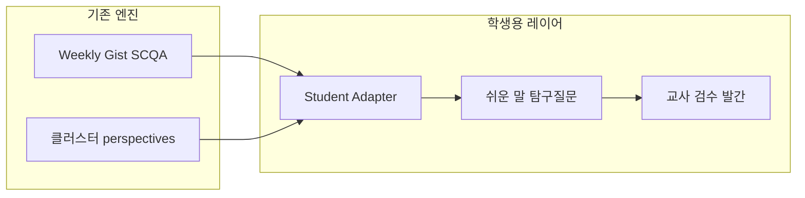

# 세특

> **문서 유형:** 제품·교육 활용 논의 (구현 전)  
> **작성:** 2026-06-02  
> **전제:** the gist. 주간 뉴스 믹스업·구조적 분석 파이프라인을 중·고등학생 대학입시 **세부능력 및 특기사항(세특)** 교육 자료로 활용할 수 있는지에 대한 타당성 검토

---

## 1. 논의 질문

- 일주일치 뉴스를 믹스업해 구조적 분석한 뒤 **발간**하는 흐름을, 세특용 교육 자료로 쓸 수 있는가?
- 지금 서비스가 쓰는 **성인·전략 브리핑 수준**의 글을, 중·고등학생이 읽을 수 있게 **풀어 쓰는 것**이 객관적으로 가능한가?

---

## 2. 결론 (한 줄)

**가능하다.** 다만 현재 파이프라인을 그대로 노출하는 것이 아니라, **독자·목적·검수가 분리된 “학생용 레이어”**를 두어야 재현 가능하다.

---

## 3. 현재 구조와 세특 요구의 정합

| 세특·탐구에 필요한 것 | the gist. 현재 역량 |
|---------------------|---------------------|
| 일주일치 이슈 묶기 | Admin **위클리 Gist** (`weekly_gist_reports`) — 클러스터·관점·`synthesis_narrative` |
| 구조적 분석 | **Multi-Perspective SCQA**, 검색 분석 3단(핵심 결론 / 관점 비교 / 시사점) |
| 여러 매체 관점 비교 | `perspectives`, `narrative_collisions` |
| 인과·중요성 설명 | `so_what`, `why_it_matters` |
| 발간·검수 | PDF·이메일·어드민 편집·`update_gist` (human-in-the-loop) |

**“주간 뉴스 믹스업 → 구조적 분석 → 발간”** 은 기술·운영 측면에서 이미 가까운 형태로 존재한다.

### 관련 코드·설정

- [`WeeklyGistService.php`](../src/backend/Services/WeeklyGistService.php)
- [`config/narrative_depth.php`](../config/narrative_depth.php) — 성인용 최소 분량 (예: synthesis ≥1200자)
- [`docs/INTELLIGENCE_USAGE_GUIDE.md`](INTELLIGENCE_USAGE_GUIDE.md)
- [`docs/NEWS_MIXUP_STRATEGIC_REPORT_KEEP.md`](NEWS_MIXUP_STRATEGIC_REPORT_KEEP.md)

---

## 4. 핵심 난이도: “쉽게 풀기”

현재 출력은 **임원·성인 의사결정** 기준이다.

- 긴 서사 (`synthesis_narrative` 1200자+, 다문단)
- 정책·지정학·공급망·시나리오 등 전문 프레이밍
- Judgment·verification은 “전략 브리핑” 품질에 맞춤

중·고·세특용은 **요약 축약**이 아니라 **별도 독자 모델**이 필요하다.

- 짧은 문장, 낮은 정보 밀도
- 전문 용어 + 짧은 정의
- **관찰 / 관점 충돌 / 탐구 질문** 중심 재구성
- 세특 연계 **활동 제안** (출처 표기, 반대 관점 찾기, 토론 질문 등)

→ LLM만으로도 가능하나, **`audience: student`** 전용 프롬프트·깊이 contract·검증 규칙이 있어야 일관된다.

---

## 5. 객관적 가능 / 제약

### 가능 (기술·운영)

1. 주 1회 **학생용 초안** 자동 생성 (위클리 Gist + 클러스터 입력)
2. SCQA를 **탐구 노트** 형식으로 표면화
3. **난이도·길이** 별도 contract (성인용 `narrative_depth.php`와 분리)
4. **2단계 발간:** AI 초안 → 교사·편집 검수 → PDF/웹

### 제약·리스크

| 항목 | 내용 |
|------|------|
| 사실·편향 | 요약 오류·편향 가능 → **출처·인용 필수**, 교사 검수 권장 |
| 세특 윤리 | 학생 기록 **대필** 오해 방지 → **“교사용 탐구 설계·참고 자료”** 포지셔닝 |
| 난이도 | 중1/고1/고3 등 **단계별** 설계 필요 |
| 교육과정 | 통합·사회·진로 연결은 **사람이 단원·루브릭 매핑** |
| 제품 혼선 | 공개 검색(성인 분석)과 **채널·템플릿 분리** 권장 |

현실적 목표: **“완성된 교과서”** 보다 **“교사가 30분 안에 쓸 주간 탐구 패키지 초안”**.

---

## 6. 권장 제품 형태 (논의안)

### 학생·교사용 1주 패키지 예시

1. **이번 주 한 줄** (학년별 可选)
2. **타임라인 3~5칸**
3. **두 가지 보기** (매체 A vs B, 균형 있게)
4. **탐구 질문 3개** (관찰·비교·가설)
5. **출처 목록** (제목·언론사·날짜)
6. **교사용 1페이지** (45분 수업·평가 루브릭 초안)

성인용 `synthesis_narrative`는 **교사 참고 원문**으로 두고, 학생용 본문은 **400~600자 + 활동** 수준이 현실적.

---

## 7. 세특 관점 가치

- 해외·국내 매체 **다원적 관점** → 비판적 읽기·비교 탐구
- **주간 이슈 묶음** → 지속 관심·심화 탐구 서사
- **구조적 분석 틀** → “요약”이 아닌 “프레임으로 생각했다”는 학습 (본문은 학생이 직접 작성)

세특 기록 자체는 학생이 써야 하므로, 본 자료는 **“무엇을 읽고 어떤 질문으로 탐구할지”**를 주는 **교사용 키트**가 적합하다.

---

## 8. 단계별 로드맵 (참고)

| 단계 | 내용 | 규모 |
|------|------|------|
| 파일럿 | 기존 위클리 Gist 1주 → 고1용 1페이지 프롬프트 실험 5~10회 | 코드 최소 |
| MVP | `student_edition` JSON + Admin 생성 + PDF | 중 |
| 품질 | 교사 피드백 → Judgment lesson (기존 패턴 활용) | 중~상 |
| 확장 | 교육과정 태그·학교별 커스텀 | 상 |

파일럿만으로도 “할 만한가”는 교사 1~2명 검토로 판단 가능.

---

## 9. 다음 논의 시 정할 것

1. 타깃: **중학 vs 고등** (또는 학년별)
2. 독자: **교사용 only** vs **학생 직접 읽기**
3. 세특 스토리: **사회 / 통합 / 진로** 중 우선 과목

---

## 10. 상태

- **구현:** 없음 (논의·기획 문서)
- **관련 배포 제품:** the gist. Intelligence(위클리 Gist·전략 레포트) — 고객 공개 검색과 별도
